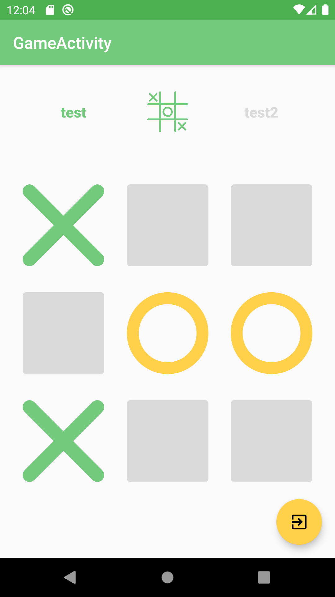

# TicTacToe

TicTacToe es una aplicación desarrollada durante el curso "Android Juegos 2D + Firebase + Multiplayer Online desde cero" impartido en la plataforma Online Udemy, donde he aplicado mis conocimientos de Android y mejorado mis aptitudes utilizando nuevas herramientas o nuevas metodologías.

Puedes comprobar el curso visitando la URL de Udemy (https://www.udemy.com/android-juegos-2d-desde-cero/) o su página de GitHub (https://github.com/Android-Avanzado/androidgames)

### Capturas de pantalla:

  
  
  
  

### Librerías y herramientas utilizadas:
* [Java](https://docs.oracle.com/javase/7/docs/)
* Android Support Libraries
* Lottie
* Firebase
* ButterKnife
